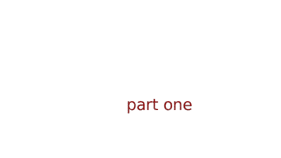
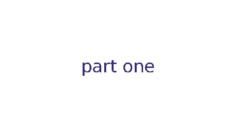

# Import Labels and Timings in Synfig (Open Source 2D Animation Studio)
##  - aka generate Keyframes and Kinetic Typography (artistic subtitles)

A [Synfig](http://synfig.org) plug-in to create time reference and/or artistic kinetic text effects in Synfig, from [Audacity](http://audacity.sourceforge.net/) track labels (aka subtitles).

Synfig Studio is a free and open-source 2D animation software, designed as powerful industrial-strength solution for creating film-quality animation using a vector and bitmap artwork.

The generated time reference (keyframes) is great for synchronizing animation with your audio.

The generated kinetic texts objects is a great basis for beautiful typographic animations, and can be customized easily to achieve your prefered effect(s).

## Gallery

Different Effects are readily available, and it is easy to create new ones:

**appearing (& disappearing) text**



**revealing text**


**descending text**




**text flying-in from left**


Got other ideas or templates? add them to the [wiki](/wiki) or [create a pull request](https://help.github.com/articles/using-pull-requests/) to share them!

Using a simple white background and importing a set of 6 text lines with their timings the following animation is generated automatically: automatic keyframes (top-right), automatic objects (bottom-right) auto-animated (bottom-left)


## Use

Run the script from within synfig:   

1. open your synfig project, save it as .sif (Synfig Plug-ins don't work on the default .sifz format for now)
1. run the plugin at _> Plug-Ins > Import Audacity Labels as Keyframes_

or from the command-line: (only on sif files, unzip sifz manually before)

	python synfig-import-labels.py in.sif (labels.txt (out.sif))

To create your own timed labels file you can:

1. use [Audacity to label track segments](http://multimedia.journalism.berkeley.edu/tutorials/audacity/adding-labels/)
1. export your labels via Tracks > Edit Labels > export, in Audacity.

or simply use Notepad and create a table with 3 "columns": _start time (in sec)_ ``tab`` _end time (in sec)_``tab`` _text (single line)_, save it as _labels.txt_. **No titles** in the first row, just the data, a bit like:

    0.500	1.50	first sentence showing for 1 second
    1.50	1.90	cool !
    2.40	3.2784	your imagination is the limit !

## Video Tutorial

The use of this plugin to generate keyframes in a complete animation design is described in the [Synfig Audio Synchronisation tutorial](http://wiki.synfig.org/wiki/Doc:Audio_Synchronisation)

A tutorial will be written on creating kynetic typographies one day... but I (not secretly) hope you beat me to it!

## Install

Decompress [plugin archive](https://github.com/berteh/synfig-import-labels/archive/master.zip ) into your synfig plugins directory (in linux: home/-user-/.synfig/plugins)

Another option is to clone [this repository](https://github.com/berteh/synfig-import-labels.git) in the same location.

Requirements: Python (Synfig is a recommended option) - more info on [Synfig Plugins page](http://wiki.synfig.org/wiki/Doc:Plugins#How_to_install_plugins)

## Configuration

edit `settings.py` for customisation:

```python
# configuration for keyframes import
#
LABELS_FILE = "labels.txt" # audacity labels file name, must be located in your synfig project directory
IMPORT_START = True                 # set to True to import keyframe for start of label
IMPORT_END = True                   # set to True to import keyframe for end of label
START_SUFFIX = ""                   # suffix to add to a label-start keyframe, to distinguish it from label-end frame
END_SUFFIX = " - end"               # suffix to add to a label-end keyframe, to distinguish it from label-start frame
OVERWRITE_KEYFRAMES_WITH_SAME_NAME = False   # set to True to replace keyframe with exact same description
GENERATE_OBJECTS = True             # set to True to generate objects (typically text layers) for each label
#
# settings below only matter to object generation. don't bother if GENERATE_OBJECTS is False. Some settings apply only to some templates.
TEMPLATE_NAME = "appearing-text"  # the name of template you want to use. must be located in templates/ subdirectory, with .xml extension. default is "appearing-text"
SPLIT_WORDS = False             # split each word in a separate object
WAYPOINT_TYPE = "halt"          # one of: constant, auto, linear, clamped, halt
RANDOM_ORIGIN = 70              # set to a percentage [0-100] to randomize the object origin in the whole document viewbox (0 will stack them all at [0,0])
#for transitions with a preliminary/conclusion
ANIMATION_INTERVAL = 0.5        # interval (before and after the label time) used for (in & out) transition, in seconds. default is 0.5
```

## Support
Preferably use github's [issues tracker](https://github.com/berteh/synfig-import-labels/issues) for bug reports, feature requests and contributing to this code.

## Changelog

- v0.1 - August 2014 - keyframe generation
- v0.2 - September 2015 - objects generation

## Licence
GNU-GPL v2, same as [Synfig Studio](http://synfig.org).

This package is free software; you can redistribute it and/or modify it under the terms of the GNU General Public License as published by the Free Software Foundation; either version 2 of the License, or (at your option) any later version.

This package is distributed in the hope that it will be useful, but WITHOUT ANY WARRANTY; without even the implied warranty of MERCHANTABILITY or FITNESS FOR A PARTICULAR PURPOSE.  See the GNU General Public License for more details.

You should have received a copy of the GNU General Public License along with this program; if not, write to the Free Software Foundation, Inc., 51 Franklin St, Fifth Floor, Boston, MA  02110-1301 USA or visit http://www.gnu.org/licenses/gpl.html